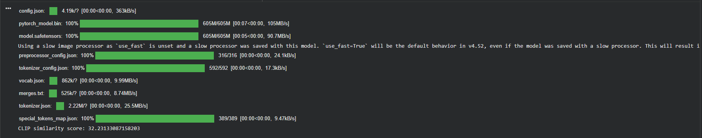

# 🎨 VisionForge - AI Image Generator (Stable Diffusion + FastAPI + Streamlit)

A **production-ready AI Image Generation system** built using **Stable Diffusion v1.5**, served via **FastAPI**, consumed by a **Streamlit UI**, and deployable to **Google Cloud Run with GPU**.

This project follows **industry-correct ML deployment practices**:
- model loads **once per container**
- no reloads per request
- clean frontend–backend separation
- Dockerized and cloud-native

---

## 🚀 Features

- 🧠 **Stable Diffusion v1.5** (Hugging Face pretrained)
- ⚡ **FastAPI backend** with lifespan-controlled model loading
- 🎨 **Streamlit frontend** for prompt-based image generation
- 🐳 **Docker & docker-compose** for local development
- ☁️ **Google Cloud Run (GPU)** ready
- 🚫 No shared filesystem between frontend & backend
- 💰 GPU-cost aware architecture

---

## 🏗️ Architecture Overview

```

┌───────────────┐        HTTP        ┌────────────────────────┐
│ Streamlit UI  │ ────────────────▶ │ FastAPI + Stable Diff.  │
│ (CPU only)    │                  │ GPU enabled             │
│               │                  │ Model loads once        │
└───────────────┘                  └────────────────────────┘

```

## 📊 CLIP-Based Evaluation

To quantitatively evaluate text–image alignment, this project uses **CLIP (Contrastive Language–Image Pretraining)**.

The model computes a similarity score between:
- The generated image
- The input text prompt

Higher scores indicate better semantic alignment.

### 🔍 Example Output



## 🔥 Sample Outputs

### Text → Image Generation
Prompt:
> "ultra-detailed portrait of a red fox wearing a tiny scarf"


---


### Core Principles

- Frontend **never touches the ML model**
- Backend **never renders UI**
- **One container = one model load**
- Requests reuse GPU memory
- Scaling = new containers (expected and safe)

---

## 📁 Project Structure

```

AI-Gen/
│
├── backend/
│   ├── app.py               # FastAPI app + endpoints
│   ├── model_loader.py      # Singleton model loader
│   ├── requirements.txt
│
├── frontend/
│   ├── ui.py                # Streamlit UI
│
├── docker/
│   ├── Dockerfile.backend
│   ├── Dockerfile.frontend
│
└── docker-compose.yml

````

---

## 🧠 Model Lifecycle (Important)

The Stable Diffusion model is:

- ❌ NOT loaded at import time
- ❌ NOT loaded per request
- ✅ Loaded **once** during FastAPI startup using `lifespan`
- ✅ Kept in GPU memory for all requests handled by that container

This prevents:
- repeated 6–10 second load times
- GPU memory churn
- accidental reloads on UI edits
- production crashes

---

## ⚙️ Backend (FastAPI)

### Model Loader (`backend/model_loader.py`)

- Loads `runwayml/stable-diffusion-v1-5`
- Uses FP16 on CUDA when available
- Singleton pattern to avoid double loading
- Safe for Docker and Cloud Run

### API Endpoint

**POST** `/generate`

#### Request Body
```json
{
  "prompt": "a cinematic cyberpunk samurai portrait",
  "negative_prompt": "blurry, low quality"
}
````

#### Response

* Raw PNG image bytes (`image/png`)
* No filesystem dependency
* Cloud-safe API design

---

## 🎨 Frontend (Streamlit)

* Prompt input
* Sends HTTP request to backend
* Displays generated image from response bytes
* API URL controlled via environment variable

```python
API_URL = os.getenv("API_URL", "http://localhost:8080/generate")
```

Works for:

* Local development
* Docker Compose
* Google Cloud Run
* Streamlit Cloud

---

## 🐳 Local Development (Docker)

### Prerequisites

* Docker
* NVIDIA GPU
* NVIDIA drivers
* NVIDIA Container Toolkit

### Run Locally

```bash
docker compose up --build
```

## ☁️ Cloud Deployment (Google Cloud Run GPU)

### Why Cloud Run?

* Fully managed containers
* Automatic scaling
* Pay-per-use GPU
* No VM management

### Deploy Backend

```bash
gcloud run deploy sd-backend \
  --image gcr.io/YOUR_PROJECT_ID/sd-backend \
  --region us-central1 \
  --platform managed \
  --allow-unauthenticated \
  --memory 16Gi \
  --cpu 4 \
  --gpu 1 \
  --timeout 900
```

⚠️ **Note**: Cloud Run GPU is paid. Use request limiting to control costs.

---

## 🔐 Environment Variables

| Variable   | Description                                  |
| ---------- | -------------------------------------------- |
| `API_URL`  | Frontend → backend endpoint                  |
| `HF_TOKEN` | Optional Hugging Face token (private models) |

---

## 💰 Cost Awareness

* GPU starts only when requests arrive
* Container shuts down when idle
* Model reload occurs only on cold start
* No GPU usage during UI idle time

---

## 🚧 Known Limitations (Intentional)

* No request queue yet
* No authentication yet
* No rate limiting yet
* Cold start latency on first request

These are conscious architectural decisions.

---

## 🔮 Planned Improvements

* ⚡ Request queue / concurrency control
* 🔐 Authentication and rate limiting
* 💾 Save generated images to Google Cloud Storage
* 🧠 Prompt presets and styles
* 💰 Further Cloud Run GPU cost optimization

---

## 🧪 Tech Stack

* Python 3.10
* FastAPI
* PyTorch
* Diffusers (Stable Diffusion)
* Streamlit
* Docker
* Google Cloud Run (GPU)

---

## 🧑‍💻 Author

Built with a focus on **real-world ML deployment**, not demos.

This repository reflects:

* correct ML lifecycle management
* cloud-native system design
* scalable architecture

---

## 📁 Project Structure

```
AI_GEN/
│
├── backend/                     # FastAPI backend (ML inference service)
│   ├── __init__.py              # Marks backend as a Python package
│   ├── app.py                   # FastAPI app entry point (API routes)
│   ├── model_loader.py          # Loads Stable Diffusion model once (singleton)
│   ├── requirements.txt         # Backend-only Python dependencies
│   └── __pycache__/             # Python bytecode cache (ignored in git)
│
├── frontend/                    # Streamlit frontend (UI layer)
│   └── ui.py                    # Prompt input + image display UI
│
├── docker/                      # Docker build definitions
│   ├── Dockerfile.backend       # GPU-enabled FastAPI container
│   └── Dockerfile.frontend      # Lightweight Streamlit container
│
├── model/                       # (Optional) Local model cache / experiments
│                                # Not required in production (Cloud-safe)
│
├── outputs/                     # Generated images (local development only)
│                                # NOT used in production / cloud
│
├── venv/                        # Local Python virtual environment (ignored)
│
├── .gitignore                   # Excludes venv, outputs, caches, etc.
├── docker-compose.yaml          # Runs frontend + backend together locally
├── main.py                      # Optional local runner / experiments
├── AI_Image_Gen.ipynb           # Jupyter notebook (model testing / research)
└── README.md                    # Project documentation
```

**Note**: This project requires a GPU for optimal performance. CPU inference is possible but significantly slower.
